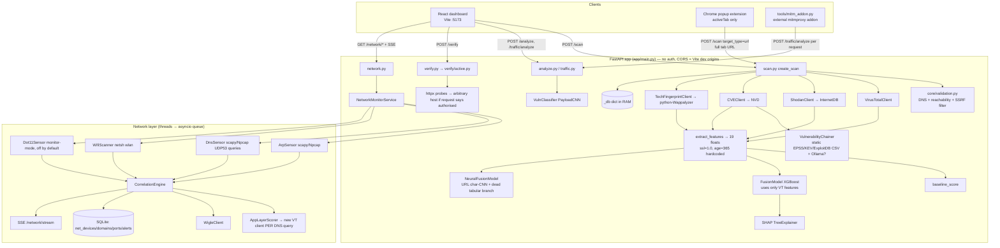

# ThreatFusion — Complete Existing-Application Audit & Technical Discovery

| | |
|---|---|
| **Audit date** | 2026-10-02 |
| **Repo / commit audited** | `Aravind2674/f-ph-ishing`, `main` @ `b28b76d` (pulled; already up to date with `origin/main`; `origin/network` is fully merged) + one uncommitted local edit to `frontend/src/api.ts` (error-message handling only) |
| **Scope** | Discovery only. **No application file, model, database, `.env`, or dependency was modified.** This file is the only thing added. |
| **Interpreter used for all runtime checks** | `backend/venv` (Python 3.14.4, torch 2.14.0+cpu, xgboost 3.4.1, shap 0.52.0, numpy 2.5.3) — see §I for why this matters |

**Evidence legend** — every claim below is tagged:
**[V]** verified by running something locally (command/result in §I or Appendix), **[S]** static code reading (file:line cited), **[U]** unverified / requires information or an approved live call.

---

## A. Executive summary

### What ThreatFusion actually is today
A FastAPI backend + React dashboard + Chrome popup extension that wraps four pieces: (1) a *domain/URL/IP/hash enrichment* pipeline (VirusTotal, Shodan InternetDB, NVD, Wappalyzer) feeding a 19-feature vector; (2) three *models* (XGBoost "fusion", a char-CNN URL model, a char-CNN HTTP-payload classifier); (3) a passive *HTTP-payload analyzer / active verifier*; (4) a *network layer* (ARP/DNS sniffers, Wi-Fi AP scanner, correlation engine, SSE alert feed).

### What is genuinely working
- Backend imports and routes mount in `backend/venv` **[V]**; all **68 unit tests pass** (5.8 s) **[V]** — but they run in mock mode and there is **no `/scan` test at all** **[V]**.
- Frontend type-checks (`tsc --noEmit`, exit 0) and lints with 0 errors / 2 warnings **[V]**.
- The two PyTorch models load and produce predictions **[V]**. The payload classifier is directionally useful on classic SQLi/XSS/traversal strings **[V, 19-string spot check only]**.
- The Wi-Fi AP scanner (`netsh wlan`) runs on this machine and has produced 18 stored alerts **[V]**.
- The network layer's *design* for honest degradation (per-sensor `available/running/reason`) is real code, and the UI surfaces it **[S]**.

### What is only partially working
- **Live `/scan`**: provider HTTP calls are real **[S]**, but any failure is converted into an empty-but-successful result (see below) — so I cannot tell you from the code whether a given live scan used real data.
- **Neural URL score**: works lexically but is badly sensitive to input formatting and false-positives on ordinary URLs **[V]**.
- **`/analyze`, `/traffic/analyze`, `/verify`, `/network/*`**: functional code paths, limited or no evidence of correctness beyond mock tests; several security/accuracy problems (§H, §E).

### What is mocked / hardcoded
- `ssl_cert_valid = 1.0` and `domain_age_days = 365.0` are **constants on every scan** — there is no TLS or WHOIS/RDAP ingestion anywhere **[S+V]** (`features.py:171-172`).
- Wappalyzer `confidence=100` for every detected technology **[S]** (`techfingerprint.py:140`).
- Mock mode (default in code, `USE_MOCK_DATA=True`) fabricates VT/Shodan/Tech/CVE data seeded by an MD5 of the target; mock CVE IDs that are real (e.g. `CVE-2017-0144`) get *invented* text/CVSS **[S+V]**.
- The "baseline" score is a hand-weighted sum (by design), and `tech_has_eol_cms_version` can **never** be 1.0 (the EOL list contains no CMS) **[V]**.
- EPSS / KEV / Exploit-DB are **static CSV snapshots from Jul 2026** (≈ 82–86 days old), not live feeds **[V]**.

### What is broken
1. **The XGBoost "ML Fusion" score is effectively a constant.** The deployed 300-tree model has 105 split nodes that use **3 of 19 features** (VT only). Over 20,000 randomly generated plausible live feature vectors it produced **exactly one value (0.00895)** **[V]**. It jumps to 0.93 only if ≥ 30.1 % of VT engines flag the target. Shodan/CVE/tech/SSL/age inputs have *zero* effect on it **[V]**. **This is the primary reason scores look "dummy".**
2. **Failures are reported as successes.** In a simulated live-mode outage (VT 401, InternetDB 503, target 500) the API returned `success=true`, `mock_mode=false`, `sources_failed=[]`, ML = 0.009 "Low", baseline = 0.0 **[V]**.
3. **`NVD_API_KEY` is absent from your `.env`**, so the `PASTE_YOUR_NVD_KEY_HERE` sentinel is sent to NVD as if real; every CVE lookup returns nothing and `shodan_max_cvss_score` is always 0 — client behaviour **[V]**; NVD's actual response to an invalid key is **[U]** (I made no live call; the simulated 404 is my assumption of its behaviour).
4. **The VirusTotal "rate limiter" does not limit anything** (8 lookups in 0.16 s) **[V]**; on the free tier real calls will start returning 429, which is swallowed into an empty result **[S]**.
5. **WiGLE returned HTTP 412 for 8 / 8 lookups** recorded in your DB; that integration has never produced a usable signal **[V]**. Root cause unknown **[U]**.
6. **ARP/DNS sensors cannot run on this machine**: Npcap is not installed and the process is not elevated **[V]**; `net_devices` and `net_device_domains` have 0 rows, i.e. they have *never* recorded a real observation **[V]**.
7. **Scan history is in-process memory only**; the `scans` table is created but never written (0 rows) **[V]**.
8. The `summary` text computed in `/scan` is silently **dropped** (`ScanResult` has no `summary` field), so the UI paragraph never renders **[V]**.

### What cannot yet be verified
Anything requiring a live provider call (VT/Shodan/NVD/WiGLE validity, tier, quotas, response shapes); packet capture with Npcap + admin; the extension inside Chrome; the dashboard in a browser; mitmproxy/Ollama paths; real-world accuracy of any model.

### Main reason current results are unreliable (one paragraph)
The headline ML score was trained on data in which most features are `random.uniform` draws *conditioned on the label* (so metrics read 1.00 and the tree learned "VT ratio > 0.3 ⇒ malicious"), then served with features on a different scale and with hardcoded neutral values for the rest — producing a near-constant output. Around it, every provider failure collapses to zeros that look like "clean", the UI labels the result "ML Fusion (XGBoost) — learned multi-source score", and the one URL-aware model is thrown off by whether the string begins with `https://`. The result is a system that returns confident-looking numbers that are not evidence.

---

## B. Verified architecture (as implemented)



Key architectural facts **[S]** unless noted:
- Two SQLite concepts share `threatfusion.db`: `scans` (created, **never written**) and `net_*` tables (written by the network layer). App-layer scans live in `scan.py:_db`, a module-level dict.
- Models are loaded **at import time** from CWD-relative paths (`ml/models/…` or `../ml/models/…`, `scan.py:46-53`). Running from any other directory silently leaves `_model.is_loaded=False`, after which `ml_score` is set **equal to the baseline score** (`scan.py:215-218`) while the UI still labels it "ML Fusion (XGBoost)".
- All clients hardcode `http://127.0.0.1:8000` (`api.ts:274`, `popup.js`, `mitm_addon.py` env override only).
- No authentication, authorization, or rate limiting anywhere (`main.py` has only CORS). `RATE_LIMIT_REQUESTS_PER_MINUTE` and `CACHE_TTL_SECONDS` in `config.py` are **dead settings** (no consumer) **[V by grep]**.

---

## C. Feature inventory

| Feature | Relevant files | Actual implementation | Verification evidence | Missing requirements | Status |
|---|---|---|---|---|---|
| Target validation (SSRF filter) | `core/validation.py`, `scan.py:93-99` | Normalise → FQDN regex → block internal → `getaddrinfo` → block internal IPs → GET reachability (`ssl=False`, no redirects). Applied to `domain`/`url` only. | Code read; edge cases reasoned | Pin resolved IP; re-check on redirects/fetch; IP/hash types bypass (no fetch, so low risk); `aiohttp` not in `requirements.txt` | **PARTIALLY WORKING** |
| VirusTotal enrichment | `ingestion/virustotal.py` | Real httpx v3 calls (`/domains`, `/urls`, `/files`), in-memory cache, "semaphore" limiter | Respx-simulated: 401 → empty `VirusTotalResult`, listed as succeeded **[V]**; limiter doesn't throttle **[V]** | Real rate limiting, 404 vs error vs 429, IP endpoint (`/ip_addresses`), persistent cache, provenance | **PARTIALLY WORKING** (failure-masking) |
| Shodan / InternetDB | `ingestion/shodan.py` | InternetDB per IPv4 from blocking `socket.gethostbyname` | Respx: 503 → empty result listed as succeeded **[V]** | async DNS, all A/AAAA, CPE→CVE, full API unused | **PARTIALLY WORKING** |
| NVD / CVE | `ingestion/cve.py` | Per-CVE `cveId` lookup, 30 s semaphore window, v3→v2 CVSS | Sentinel key sent, 404 → `total_cves=0` **[V]**; no retry/backoff/pagination | Real key, backoff, bulk by CPE, store EPSS/KEV | **BROKEN** (in your config) |
| Tech fingerprinting | `ingestion/techfingerprint.py` | python-Wappalyzer on fetched HTML; `follow_redirects=True` | Regex-compile warnings for some signatures **[V]**; `wappalyzer_tech.json` never loaded **[V]** | EOL data, SSRF-safe fetch, real confidence | **PARTIALLY WORKING** |
| TLS / domain age / DNS / WHOIS | — | **Not present**; features hardcoded | **[V]** | RDAP/WHOIS, TLS handshake, DNS records | **NOT IMPLEMENTED** |
| Feature extraction (19-d) | `ml/features.py` | VT/Shodan/CVE/Tech → floats; empty-vs-missing indistinguishable | Empty VT ⇒ `rep=0.5` and all-None ⇒ same XGB score **[V]** | Missingness flags, real ssl/age, fix `EOL_SET` | **PARTIALLY WORKING** |
| Baseline scorer | `ml/baseline.py` | Hand-weighted clamped sum | Deterministic; varies with inputs **[V]** | Calibration against labelled data | **PARTIALLY WORKING** (heuristic by design) |
| XGBoost fusion + SHAP | `fusion_model.py`, `explain.py`, `ml/models/fusion_model.json` | 19-feature artifact, only 3 used | One distinct output over 20k vectors **[V]** | Retrain on real labelled multi-source data | **BROKEN** |
| Neural URL model | `neural_fusion.py`, `url_model.py` | Char-CNN + tabular MLP + registered-domain allowlist cap 0.15 | Loads **[V]**; scheme-prefix flips 0.13→0.99 **[V]** | Input canonicalisation, OOD evaluation, drop/train tabular branch | **PARTIALLY WORKING** |
| Payload classifier (`/analyze`) | `vuln_classifier.py`, `api/analyze.py` | 5-class char-CNN, truncates at 256 chars | Spot checks: `\| whoami`→benign 0.999; padding evasion **[V]** | Held-out external eval, windowing | **PARTIALLY WORKING** |
| Traffic analysis (`/traffic/analyze`) | `recon/traffic.py`, `api/traffic.py` | HAR/batch → per-value classification | Unit tests pass (mock) **[V]** | Size limits, async/threadpool, evaluation | **PARTIALLY WORKING** |
| Active verification (`/verify`) | `verify/active.py`, `api/verify.py` | XSS canary + error/boolean SQLi probes | Unit-tested against fake client; scope list is caller-supplied **[S+V]** | Server-side scope control, SSRF guard | **PARTIALLY WORKING** (unsafe scope model) |
| Attack-chain analysis | `ml/chaining.py` | Static CSVs + optional Ollama; NetworkX | Heuristic fallback: max **1** CVE per "chain" **[V]** | Real multi-step graph, live feeds | **PARTIALLY WORKING** |
| Scan history | `scan.py:_db`, `main.py` (unused table) | In-memory dict | `scans` rows = 0 **[V]** | Persistence | **BROKEN** (lost on restart) |
| ARP sensor | `sensor/arp_sensor.py` | scapy sniff `arp`, IP→MAC table | Npcap absent here **[V]**; 0 devices recorded **[V]** | Npcap + admin, DHCP-churn handling | **NOT VERIFIED** (cannot run here) |
| DNS sensor | `sensor/dns_sensor.py` | scapy sniff UDP/53 *queries*, IPv4 only | same | Responses, TCP/53, DoH/DoT, IPv6, packet timestamps | **NOT VERIFIED** |
| Wi-Fi AP scanner | `sensor/wifi_scanner.py` | `netsh wlan show networks mode=bssid` poll | 18 stored alerts **[V]** | Non-Windows support; evil-twin FP control | **PARTIALLY WORKING** |
| 802.11 deauth sensor | `sensor/dot11_sensor.py` | Requires monitor iface | Off by default; honest reason | Hardware | **NOT VERIFIED** |
| Correlation + scoring | `network/correlation.py` | Additive signal points → 0-100 | Unit tests pass **[V]** | Real inputs (see above) | **PARTIALLY WORKING** |
| WiGLE enrichment | `enrichment/wigle.py` | Basic-auth `network/search?netid=` | 8/8 lookups HTTP 412 in DB **[V]** | Root cause | **BROKEN** (as recorded) |
| Per-device baseline | `baseline_store.py` | SQLite counts of (mac,domain) | 0 rows **[V]**; `record_port` has no callers **[V]** | Real data; ports | **NOT VERIFIED** |
| SSE stream + UI | `api/network.py`, `NetworkSection.tsx` | SSE with 15 s keep-alive; native `EventSource` reconnect | Code read only | No backfill after reconnect; not browser-tested | **NOT VERIFIED** |
| Chrome extension | `extension/*` | Popup; posts active-tab URL to `/scan` | Code read only | Content scripts / webRequest (absent) | **PARTIALLY WORKING** |
| Browser request observation | — | Absent | **[V]** | MV3 `webRequest`/`webNavigation` design | **NOT IMPLEMENTED** |
| mitmproxy bridge | `tools/mitm_addon.py` | External passive addon, sync POST per request | Not run (mitmproxy not installed) | Async batching, header redaction | **NOT VERIFIED** |
| Frontend dashboard | `frontend/src/**` | Live API calls; mock/live badge; no sample data found | `tsc` 0 errors **[V]**; not run in browser | Per-scan mock flag in UI type; honest labels | **PARTIALLY WORKING** |

---

## D. API endpoint inventory

All routes are unauthenticated; server binds to loopback unless started otherwise. FastAPI also exposes `/docs`, `/redoc`, `/openapi.json`.

| Method | Route | Input | Processing | Dependencies | Output | Error behaviour | Caller | Status |
|---|---|---|---|---|---|---|---|---|
| GET | `/health` | — | Returns `mock_mode` from settings | config | `{status,version,mock_mode}` | none | Dashboard badge, Settings, popup | VERIFIED WORKING (tests) |
| POST | `/scan` | `{target (1–2048), target_type}` | Validate (domain/url) → VT → InternetDB (domain/ip) → NVD (if vulns) → Tech (url/domain) → chain → features → baseline/XGB/SHAP/neural | VT, InternetDB, NVD, target site, 3 models, CSVs, Ollama? | `ScanResponse{success,result,error}`; `result.summary` dropped | Validation fail → **HTTP 400 `{success:false,stage,message}`**; per-source exception → name in `failed`; **empty provider result → counted as success**; outer exception → HTTP 200 `success:false` | `App.handleScanSubmit`, extension popup | PARTIALLY WORKING |
| GET | `/scan/history` | — | Sort in-memory dict | RAM | list of `ScanHistoryItem` | none | `History.tsx` | BROKEN (non-persistent) |
| GET | `/scan/{id}` | path | RAM lookup | RAM | `ScanResponse` | 404 | none found in UI | PARTIALLY WORKING |
| POST | `/analyze` | `{text ≤ 8192}` | Split to values, PayloadCNN per value | vuln_classifier.pt | findings, summary | model missing → `success:false,error:"model_not_loaded"` (HTTP 200) | `Inspector.tsx` | PARTIALLY WORKING |
| POST | `/traffic/analyze` | `{requests[] , har?}` **no list/size cap** | Extract query/path/body values → classify | vuln_classifier.pt | per-request verdicts | same as above | `Inspector.tsx`, `mitm_addon.py` | PARTIALLY WORKING |
| POST | `/verify` | `{target, authorized_hosts[]}` | Scope gate, then XSS/SQLi probes via httpx (`verify=False`) | network → any host | probes + summary | out-of-scope → `success:false` | `VerifyPanel.tsx` (always sends `[]`) | PARTIALLY WORKING (unsafe) |
| GET | `/network/status` | — | Per-sensor health | service | `MonitorStatus` | — | `NetworkSection` (poll 10 s) | VERIFIED (code) |
| POST | `/network/monitor/start` / `stop` | none (body-less) | Spawn/stop sensor threads | scapy/Npcap, netsh | `MonitorStatus` | sensor failures → status only | `NetworkSection` | NOT VERIFIED |
| GET | `/network/alerts` | `severity?`, `limit 1–1000` | In-memory list (hydrated from DB at boot) | SQLite | alerts | — | `NetworkSection` | PARTIALLY WORKING |
| GET | `/network/alerts/{id}` | path | dict lookup | — | alert | 404 | **no UI caller** | — |
| GET | `/network/devices`, `/network/devices/{mac}` | — | SQLite profiles | SQLite | profiles | 404 | **no UI caller** | NOT VERIFIED (0 rows) |
| GET | `/network/stream` | — | SSE: alert events + 15 s comment heartbeat | service | `event: alert` | queue full → drop for slow client | `subscribeAlerts` | NOT VERIFIED |

Note: the audit prompt's `/traffic` does not exist; the real route is `/traffic/analyze`.

---

## E. ML audit

| Model | Artifact | Training provenance | Expected inputs | Actual inference path | Evaluation evidence | Limitations | Status |
|---|---|---|---|---|---|---|---|
| **XGBoost FusionModel (deployed)** | `ml/models/fusion_model.json` (300 trees, `binary:logistic`, 19 features, XGB 3.3.0) | Replaced 2026-07-16 in commit `dc3aba0` together with `ml/train_real.py` (300 est., depth 5 — matches). In `train_real.py` the label-conditioned features (`vt_*`, `tech_*`, `ssl`, `domain_age`) are `random.uniform(...)` draws **inside the labelled loops** (e.g. lines 148-151, 183-186, 220-223); benign class = 20 domains × 10 repeats; real data = only Shodan counts. **[S]** | 19 floats in `schemas.FeatureVector` order (matches artifact `feature_names`) **[V]** | `scan.py` → `FusionModel.predict_proba` → class-1 prob; SHAP `TreeExplainer` on same booster | `training_metrics.json` = accuracy/precision/recall/F1 **all 1.0** (leakage signature). `evaluation_metrics.json` (F1 0.84) last written 2026-07-11, **before** this model existed, and evaluates on `train.py`'s synthetic generator with 15 % injected label noise (≈ the 0.85 accuracy ceiling). Baseline threshold "calibrated" on the eval set (`evaluate.py:116`). **Unsupported claim**: docs say "ROC-AUC 0.86 vs 0.82, F1 0.84 vs 0.77"; the JSON says AUC 0.847 vs 0.797, F1 0.840 vs 0.696. | Uses 3 features. Trained with VT reputation on −100…100 scale; served normalised to 0…1 (split at 60.04 can never go right). Output is a step function (0.0090 / 0.9302). Not calibrated. SHAP is log-odds but rendered as "(+0.31 risk)". | **BROKEN** |
| XGBoost v1 (13 feat.) | `fusion_model_v1_baseline.json` | Initial commit; `train.py` synthetic | 13 floats | Only used by `evaluate.py` | same synthetic eval | Not used at runtime | Legacy |
| **NeuralFusionModel / UrlFusionNet** | `neural_fusion.pt` + `_config.json` (41,539 params) | `ml/train_neural.py --real` on faizann24 `data.csv` (20k+20k after ≤3/host dedup), random 80/20 split. Data not in repo (`ml/data/` empty; gitignored) **[V]** | URL string (lower-cased, 200 chars) + 19 floats | `scan.py` passes **raw `request.target`**; allowlist caps score at 0.15 for top-3000 registered domains | `neural_fusion_metrics.json`: fused F1 0.943 / AUC 0.983; **text-only 0.943/0.982; tabular-only AUC 0.50** → the "fusion" adds nothing; metrics are in-distribution random split, single corpus. | `tab_std` all zeros ⇒ tabular branch trained on a **constant** vector; at inference it reacts to arbitrary magnitudes: for an unlisted benign URL, `vt_last_seen=300, domain_age=5000` moves 0.04 → 0.90 while `vt_malicious_ratio=0.9` moves nothing **[V]**. Scheme sensitivity **[V]**: `some-neutral-site.org` 0.125 bare vs 0.882 `https://` vs 0.992 `https://www.`. 6 of 8 hand-picked ordinary non-allowlisted URLs (`/checkout`, `/signin`, `/account/settings`…) scored ≥ 0.94 **[V, anecdotal]**. UI labels the fused output "Combined Risk (AI + Reputation)". | **PARTIALLY WORKING** (lexical only) |
| **VulnClassifier / PayloadCNN** | `vuln_classifier.pt` (40,869 params) | `ml/train_vuln.py` on Morzeux HttpParamsDataset (CSIC-2010 + payloads); stratified random split; classes: benign 19,304 / sqli 10,852 / xss 532 / traversal 290 / **cmdi 89** | text ≤ 256 chars, lower-cased | `/analyze`, `/traffic/analyze` | `vuln_classifier_metrics.json`: accuracy 0.9994, macro-F1 0.991; test support for cmdi = **18**, traversal = 58 | Random split of a known highly-separable corpus (near-duplicate payloads across split); no external test set. Spot checks **[V, n=19]**: `\| whoami` → benign 0.999; `admin' --` → cmdi; `$(curl …\|sh)` → xss; `select a color from the list` → sqli 0.85; 310-char padded payload → path-traversal 0.97 (truncation at 256); comment-obfuscated SQLi misclassified. Softmax "confidence" is uncalibrated. | **PARTIALLY WORKING** |
| SHAP TreeExplainer | `explain.py` | n/a | same 19 floats | Fresh explainer per request (slow), real `shap.TreeExplainer` path runs **[V]** | Same 3 non-zero attributions as native TreeSHAP | Explains a model that ignores 16 features; log-odds vs "risk" wording | **PARTIALLY WORKING** |
| URL saliency | `NeuralFusionModel.explain_url` | n/a | URL | gradient-norm per char | none | Explains the text head; no faithfulness test | **NOT VERIFIED** |
| Baseline heuristic | `baseline.py` | expert weights | 19 floats | `baseline_score` | See XGB row | Treats SSH (22) as "high-risk"; hardcoded constants shift every score | Heuristic |

**Realistic validation plan (summary; detail in §J-P2):** (1) define the label (maliciousness vs exposure — the platform currently mixes both); (2) collect *real* enrichment snapshots at labelling time for URLhaus/PhishTank/OpenPhish positives and Tranco negatives; (3) host- and time-disjoint splits; (4) no synthetic features; (5) report PR-AUC, calibration, per-class results with confidence intervals; (6) a regression test that fails if a model uses fewer than N features or if output variance on a feature grid is ~0; (7) re-evaluate baseline fairly (threshold tuned on train only); (8) external test sets for both CNNs; (9) store model card + data hash + feature-schema version next to every artifact.

---

## F. Integration & configuration inventory

### F.1 Providers

| Provider | Client / call sites | Auth & endpoint | Parse / use | Timeouts / retry / cache / limits | Used in score? | Stored w/ timestamp+provenance? | No-record vs failure | Status | Safe test |
|---|---|---|---|---|---|---|---|---|---|
| **VirusTotal** | `virustotal.py`; `scan.py:129-143`; `app_layer.py:122` | `x-apikey` header; `/domains/{d}`, `/urls/{b64}`, `/files/{h}` (IP targets wrongly go to `/domains/`) | `last_analysis_stats`, `reputation`, `categories` | 15 s timeout; **no retry**; cache is per-instance and a **new client is created per scan/DNS event ⇒ cache never hits**; limiter ineffective **[V]** | Yes (XGB uses only these) | No (only embedded in scan result; `last_analysis_date` kept) | **Indistinguishable**: any HTTP error → `{}` → zeros | PARTIALLY WORKING | One lookup of a benign reserved domain after approval; assert 200 and parsed counts |
| **Shodan InternetDB** | `shodan.py`; `scan.py:146-167` | no key; `internetdb.shodan.io/{ip}` | ports, vulns, cpes, tags | 15 s; 404 → empty (correct); other error → empty (**masked**) | features only (no effect on XGB) | No | 404 vs error: 404 handled; errors masked | PARTIALLY WORKING | `8.8.8.8` GET (free, keyless) |
| **Shodan full API** | `lookup_ip_full` | `?key=` query param (leaks to logs) | richer banners | — | **Never called** | — | — | NOT IMPLEMENTED (dead code) | n/a |
| **NVD** | `cve.py`; `scan.py:170-177` | `apiKey` header; `services.nvd.nist.gov/rest/json/cves/2.0?cveId=` | CVSS v3.1→3.0→2 | 30 s window semaphore; no retry/backoff; 403/404/timeouts → `None` (skipped) | `max_cvss` feature (no effect on XGB) | No | **Masked**; scan still lists "NVD" as succeeded | BROKEN in current config | One `cveId` GET with a real key |
| **Wappalyzer** | `techfingerprint.py` (library, local rules) | none; fetches target (`follow_redirects=True`, 10 s) | technologies, versions | challenge-page heuristic; errors → empty | features (no effect on XGB) | No | Empty on error | PARTIALLY WORKING | Fetch a site you control |
| **EPSS / CISA KEV / Exploit-DB** | `chaining.py` | **local CSV snapshots** (EPSS 2026-07-12, KEV latest 2026-07-10, EDB latest 2026-07-08) | by CVE ID | n/a | Only `attack_paths` (not features/score) | n/a | "no row" ⇒ EPSS 0.0 | PARTIALLY WORKING (stale) | Offline unit test |
| **WiGLE** | `wigle.py` | Basic auth; `api.wigle.net/api/v2/network/search?netid=` | `totalResults`, first/last seen | 20 s; any non-200 ⇒ unavailable | AP alerts only | In alert JSON | Distinguishes found/not-found/unavailable (good design) | **BROKEN** (412 ×8) | Single BSSID query with approval |
| **Ollama** | `chaining.py:105-140` | `localhost:11434`, model `llama3`, 5 s | pre/post-conditions JSON | silent fallback | attack paths | No | silent | NOT VERIFIED | `GET /api/tags` locally |
| **DNS / TLS / domain-reputation / RDAP** | — | — | — | — | — | — | — | NOT IMPLEMENTED | — |
| PhishTank / URLhaus / Tranco | `ml/data_sources.py` (training only) | public downloads | labels | n/a | no | no | n/a | Offline training tooling | — |

### F.2 Environment variables & config

| Name | Purpose | State on this machine |
|---|---|---|
| `USE_MOCK_DATA` | mock/live switch (code default **true**) | `.env` = `false` → **live** |
| `VIRUSTOTAL_API_KEY` | VT | **Present, unverified** (set, 64 chars) |
| `SHODAN_API_KEY` | Shodan full API (unused path) | Present, unverified; not needed |
| `NVD_API_KEY` | NVD | **Missing** → sentinel `PASTE_YOUR_NVD_KEY_HERE` sent as a real key |
| `WIGLE_API_NAME`, `WIGLE_API_TOKEN` | WiGLE | Present, **not working (412)** |
| `DATABASE_URL` | SQLite path | default `sqlite:///./threatfusion.db` (CWD-relative!) |
| `LOG_LEVEL` | logging | default INFO |
| `NETWORK_CAPTURE_INTERFACE`, `NETWORK_MONITOR_INTERFACE`, `NETWORK_GATEWAY_IP`, `NETWORK_MONITORED_SSIDS`, `NETWORK_AUTO_START` | sensors | not set in `.env` (defaults: blank/false) |
| `BASELINE_MIN_OBSERVATIONS`, `WIFI_SCAN_INTERVAL_SECONDS`, `DEAUTH_FLOOD_THRESHOLD`, `DEAUTH_WINDOW_SECONDS` | tuning | defaults |
| `RATE_LIMIT_REQUESTS_PER_MINUTE`, `CACHE_TTL_SECONDS` | declared | **Dead** (no consumer) |
| `TF_BACKEND` | mitm addon target | optional |
| Settings behaviour | `.env` is read from **CWD** (`env_file=".env"`), so start the server from `backend/` |

### F.3 Dependencies, services, permissions

- **Python**: README says 3.11+; every interpreter here is 3.14.4. `requirements.txt` uses only `>=` (no pins/lockfile); `setuptools<82` is a workaround for python-Wappalyzer's `pkg_resources`. **`aiohttp` is imported by `core/validation.py` but missing from `requirements.txt`** **[V]**; `playwright` (used by `capture*.py`) is also not listed.
- **Interpreters present**: system Python 3.14 → `import app.main` **fails** (`numba` needs NumPy ≤ 2.4, has 2.5.2) **[V]**; `backend/.venv` (Jul 11) → fails (no `torch`, no `scapy`) **[V]**; `backend/venv` (Sep 28) → **works** **[V]**. Two of three environments break → pinning is a real reproducibility need.
- **Node**: v24.15.0 / npm 11.12.1; `node_modules` present; Vite 8, React 19, TS 6.0.
- **System**: Npcap (**missing**), Administrator (**not elevated** in this tool process), WLAN AutoConfig (running), Ollama (not checked), mitmproxy (not installed).
- **Extension permissions**: `activeTab`, host `127.0.0.1:8000`/`localhost:8000` — matches implemented features **[S]**.
- **Not applicable**: Docker, CI/CD, hosting config — **none exist in the repo** **[V]**.

---

## G. Network sensor audit

### G.1 Capability classification

| Capability | Status | Details |
|---|---|---|
| **A. Passive packet capture + metadata** | **Partially implemented, not operational here** | scapy sniffers for ARP and UDP/53 DNS *queries* only. No flows, ports (`record_port` is dead), TLS SNI/ClientHello, HTTP, or DNS responses. Needs **Npcap + elevation** (neither present). Timestamps are `datetime.now()` at callback, not packet time. IPv4 only (`pkt[IP]`), so IPv6 queries lose the IP. |
| **B. Browser-level observation** | **Not implemented** | Extension has no content script/service worker/`webRequest`; it only POSTs the active tab URL on click. |
| **C. Local HTTP(S) proxy inspection** | **Tooling only** | `tools/mitm_addon.py` is a separate, passive mitmproxy addon feeding `/traffic/analyze`. Not integrated, not started by the app, not exercised here. |
| **D. Authorised TLS interception** | **Not implemented in-app** | Only possible via user-installed mitmproxy CA; documented, not built. |
| **E. Active request/packet modification** | **Not implemented (correctly)** | `/verify` sends probe requests but does not modify traffic. |

### G.2 What the current sensors can and cannot observe

- **ARP**: broadcast ARP requests (visible to everyone on the segment) and replies addressed to the host. Reports `(ip, mac)` bindings and IP→different-MAC conflicts. Cannot tell DHCP re-assignment from spoofing; MAC randomisation will create "new devices".
- **DNS**: only queries the capture host *can see*. On a switched/Wi-Fi network a normal host sees **its own** DNS plus broadcast/multicast; **other devices' DNS is invisible** unless the host is the gateway/hotspot or a mirror port. That means the "per-device behavioural baseline" for *other* devices is not achievable by a plain laptop sniffer. DoH/DoT/mDNS are not handled (mDNS `*.local` and reverse-PTR names are not filtered).
- **Wi-Fi AP scan** (Windows `netsh`): real SSID/BSSID/channel/signal for visible APs. Works here (exit 0, 1 BSSID visible) **[V]**.
- **802.11 monitor-mode deauth**: disabled unless `NETWORK_MONITOR_INTERFACE` is set and the adapter/driver supports it.
- **Encrypted traffic**: honest about payloads (never inspects them); no TLS metadata is collected at all.

### G.3 Data reality on this machine **[V]**
- `net_alerts`: 18 rows (10 × `rogue_ap` Low, 8 × `evil_twin` High), all from the Wi-Fi scanner, 2026-07-22 07:42–08:09 UTC.
- `net_devices` = 0, `net_device_domains` = 0, `net_device_ports` = 0 → **no ARP/DNS observation has ever been stored**.
- WiGLE: 10 alerts "credentials not configured", 8 alerts "HTTP 412".
- Evil-twin logic fires High (50 pts = threshold) for *any* new BSSID carrying a monitored SSID; in 2 of 8 the "new" BSSID shares its first five octets with an already-known BSSID of that SSID (typical multi-radio/mesh) → likely false positives.

### G.4 Other network-layer defects **[S]**
- `AppLayerScorer.score` builds **new** VT/Shodan clients per DNS event and has no dedup/cache: every DNS query becomes a VT request ⇒ quota exhaustion within seconds on a real LAN, and each failure is masked as "0/0 engines, live" — contradicting the module's "honesty contract".
- `flagged = malicious>0 or suspicious>0 or m_score>=0.5`: a single AV engine hit triggers a "Known device → flagged domain" alert.
- Every observed domain (including internal names) is sent to VirusTotal — a privacy leak; DNS-name bytes are interpolated into the VT URL path unvalidated.
- `scapy.sniff(stop_filter=…)` only evaluates when a packet arrives, so `stop()` may not stop a quiet sensor and `start()` after `stop()` can be refused (`BaseSensor.start` returns while `running` is still true). `AsyncSniffer` would fix this.
- Persistent retention of every (device, domain) pair, unencrypted, with no retention limit.

### G.5 What it takes to become a real sensor
Install Npcap (WinPcap-compat optional), run elevated; pick interface explicitly; run on the gateway/hotspot or a mirror port for multi-device visibility; parse DNS responses (rcode, answers, TTL) and TLS ClientHello (SNI) rather than only queries; cache/dedup/rate-limit reputation lookups and exclude private suffixes; packet-time stamps; AsyncSniffer lifecycle; retention policy; explicit "inactive/degraded" UI state (already modelled).

---

## H. Security audit

Severity = practical impact × exploitability × confidence. Default deployment is a developer laptop on loopback; severities in *italics* apply if the service is exposed on a network.

### H.1 Confirmed (code-proven; unit test or execution where noted)

| # | Sev. | Finding | Evidence | Impact | Remediation |
|---|---|---|---|---|---|
| H1 | **High** (*Critical*) | **`/verify` scope is self-attested.** `authorized_hosts` comes from the same request body that names the target (`api/verify.py:33`, `schemas.VerifyRequest`); the existing unit test `test_host_is_authorized_respects_allowlist` proves any caller-supplied host is accepted. Loopback is also always in scope; probes run with `verify=False`. | `verify/active.py:83-86,201` | Anyone who can reach the API can make the server send XSS-canary and SQLi probes (incl. boolean/OR payloads) to **any** internet or internal host (SSRF + attack proxy). | Server-side configured allowlist (env/DB), explicit operator consent token, deny private/metadata ranges unless explicitly configured, audit log, rate cap. |
| H2 | **High** | **SSRF gaps in `/scan`.** Validation resolves once; `TechFingerprintClient` later re-resolves and fetches the *original string* with `follow_redirects=True` and **no destination re-check** → DNS-rebinding TOCTOU and redirect-to-`169.254.169.254`/RFC1918. Blocking `socket.gethostbyname` (IPv4 only) is used for Shodan. | `scan.py:93-99,150-159`, `techfingerprint.py:42-46,114`, `validation.py:90-154` | Internal port/host probing; limited data exposure (responses are only parsed for tech signals). | One safe-fetch helper: resolve → validate every A/AAAA → connect to the pinned IP, validate each redirect hop, restrict ports/schemes, cap size/time. |
| H3 | **Medium** | **No authentication/authorisation; no CSRF defence on state-changing, body-less POSTs** (`/network/monitor/start|stop`) which are "simple" cross-site requests. DNS-rebinding can read `/network/*` and `/scan/history`. Server does not check `Host`. | `main.py` (CORS only), `api/network.py:43-56` | A web page the user visits can start/stop packet capture; local data disclosure via rebinding. [U — not demonstrated in a browser] | Local API token (header) + `Host` allow-list + `SameSite`-safe design; require JSON content-type. |
| H4 | **Medium** | **Provider-quota/DoS & event-loop blocking.** No rate limit on `/scan`; VT limiter ineffective **[V]**; NVD calls are serial with 30 s windows (≥ minutes for CVE-heavy hosts, no overall timeout); torch inference and `socket.gethostbyname` run synchronously inside `async def` handlers; `/traffic/analyze` accepts unbounded `requests`/HAR. | `scan.py:159`, `api/analyze.py`, `traffic.py`, `schemas.TrafficAnalyzeRequest` | One client can stall the whole process (including the SSE stream) or burn all API quota. | Threadpool/`run_in_executor` for inference; request-size caps; per-IP rate limit; per-scan deadline; job queue. |
| H5 | **Medium** | **Privacy leakage to third parties.** The extension sends the *full active-tab URL* (paths, query strings, tokens) to the backend, which sends it to VirusTotal (`lookup_url`) and fetches it; the network layer sends every observed domain (incl. internal names) to VT. | `popup.js:~81`, `scan.py:134-135`, `app_layer.py:122` | Disclosure of browsing history/secrets. | Strip query/fragment by default, opt-in, skip private suffixes (`.local`, `.lan`, `.internal`, PTR), hash-only lookups where possible. |
| H6 | **Medium** | **Sensitive data at rest.** Device MACs/IPs and a permanent per-device domain history in unencrypted SQLite; no retention. Mitm addon forwards all headers (cookies/Authorization) to the backend (not persisted, but transits). | `baseline_store.py`, `tools/mitm_addon.py:69-71` | Surveillance-grade log if the DB leaks. | Retention TTL, hashing/truncation of domains, header redaction, document data handling. |
| H7 | **Low-Med** | **Unpinned, partly undeclared dependencies**; `torch>=2.0` allows versions where `torch.load` defaults to unsafe pickle (`weights_only=False`) on `.pt` files. `pip check` clean; **no CVE scan run** (needs network). | `requirements.txt`; `url_model.py:309`, `vuln_classifier.py:171` | Supply-chain/reproducibility; deserialisation risk only if artifacts are untrusted. | Lock files, `weights_only=True`, hash-pin artifacts, `pip-audit`/`npm audit` in CI. |
| H8 | **Low** | TLS verification disabled (`ssl=False` in reachability check; `verify=False` in `/verify`). | `validation.py:104`, `active.py:201` | MITM-able probes; acceptable only for scoped lab use. | Make opt-in per target. |
| H9 | **Low** | Config footgun: placeholder sentinels (`PASTE_YOUR_…`) are treated as real keys and sent to providers. | `config.py:35-37`, `[V]` probe | Leaks nothing secret, but silently breaks NVD/VT. | Treat sentinels as unset; startup config report. |
| H10 | **Info** | Shodan full-API key would be sent as a `?key=` query param (dead code today). | `shodan.py:223-226` | Key in logs/proxies if ever enabled. | Use header/avoid. |

### H.2 Checked and found clean **[S + grep]**
- **SQL injection**: 21 `execute()` call sites, all static SQL or `?` placeholders.
- **Command injection**: single `subprocess.run(["netsh", …])` with fixed argv, no shell.
- **XSS**: no `dangerouslySetInnerHTML`/`eval`; the only `innerHTML` sink (`popup.js:41`) interpolates a fixed string chosen by a boolean.
- **Secrets in repo**: `.env` was never committed; no key-shaped literals in tracked files (`.env.example` history holds placeholders only); frontend contains no keys **[V]**.
- **CORS**: restricted to Vite dev origins (the extension is exempt via host permissions); `allow_credentials=True` is unnecessary.
- **Logging**: stderr only; scan targets and URLs are logged at INFO.

### H.3 Unverified risks needing validation
DNS-rebinding/CSRF reachability from a real browser (H3); redirect-based SSRF (H2) against a *local* test server; behaviour of Windows `getaddrinfo` on exotic IP spellings (`127.0.0.01`, decimal/hex) — the DNS-result check should catch them but was not executed.

---

## I. Test and execution results

### I.1 Commands actually executed (all read-only unless noted)

| # | What | Result |
|---|---|---|
| 1 | `git fetch --all --prune`, `git pull --ff-only` (per your instruction) | **Already up to date** at `b28b76d`; `origin/network` fully merged; local `api.ts` edit untouched |
| 2 | Repo inventory, source reading of backend, ML, network, extension, frontend, docs | See Appendix C for coverage |
| 3 | Parse `fusion_model.json` internals (split features/thresholds) | 105 split nodes: `vt_malicious_ratio` 78 (@0.301), `vt_suspicious_ratio` 25 (@≈0.10), `vt_reputation_score` 2 (@60.04); 16 features unused |
| 4 | `python -c "import app.main"` under three interpreters | system 3.14: **FAIL** (`numba` vs NumPy 2.5.2); `backend/.venv`: **FAIL** (`torch` missing); `backend/venv`: **OK** |
| 5 | `pytest -p no:cacheprovider -q` (venv) | **68 passed, 22 warnings, 5.76 s** (mock mode; no `/scan` test; no live providers; no sensors) |
| 6 | ML probes (venv) — grid over VT ratio, 12 single-feature perturbations, 20,000 random plausible vectors, real `explain_prediction`, neural tabular sensitivity, 19 payload strings | See §E and Appendix A |
| 7 | In-process `/scan` traces via `TestClient`, DNS/validation stubbed; **mock** and **respx-simulated outage** (every httpx call intercepted; unmatched calls raise) | Appendix B |
| 8 | VT limiter micro-test, NVD sentinel test, scheme-prefix test (respx; no network) | Limiter: 8 calls / 0.16 s; NVD: sentinel header sent ×2 → `total_cves=0`; scheme sensitivity as in §E |
| 9 | Read-only SQLite inspection (`mode=ro&immutable=1`; counts/aggregates only, no MACs/SSIDs/domains printed) | §G.3 |
| 10 | `Get-Service npcap`, file checks, elevation check, `netsh wlan show interfaces/networks` (counts only) | Npcap **absent**; not elevated; WlanSvc running; `netsh` exit 0, 1 BSSID |
| 11 | `tsc -p tsconfig.app.json --noEmit --incremental false` | **exit 0** |
| 12 | `oxlint` | **0 errors, 2 warnings** (`only-export-components` in `button.tsx`, `badge.tsx`) |
| 13 | `pip check` (venv) | No broken requirements |
| 14 | Secret scan of tracked files + history; `.env` key *status* only (values never printed) | Clean (§H.2) |
| 15 | Integrity check after all runs | `git status`: only the pre-existing `api.ts` modification (+ this report); DB / `.env` / model files unchanged |

### I.2 Not run, and why
- **Any live provider call** (VT/Shodan/NVD/WiGLE/Ollama) — would consume quota / reach external systems; needs your approval (see §K).
- **Starting `uvicorn`** — lifespan initialises the dev SQLite DB; I used in-process `TestClient` instead (no lifespan).
- **`npm run build`** — writes `dist/`; "do not rebuild".
- **`ml/train*.py`, `ml/evaluate.py`** — overwrite models/results.
- **Packet capture** (needs Npcap + admin, and would record your network's traffic), **mitmproxy**, **extension in Chrome**, **dashboard in a browser**, **`pip-audit` / `npm audit`** (network).

### I.3 Notable test-suite facts
No test covers `/scan` end-to-end, provider failure handling, the network sensors, concurrency, or `authorized_hosts` bypass; `test_fusion.py` passes because its "malicious" fixture sets `vt_malicious_ratio` above 0.301 — it cannot detect that 16 of 19 features are ignored.

---

## J. Prioritised upgrade roadmap

Effort: **S** ≈ ≤ 1 day-equivalent of focused work, **M** ≈ several days, **L** ≈ 1–2+ weeks. (Relative sizing only.)

### P0 — Correctness, security, data integrity (do first; mostly independent)

| ID | Task | Why | Files | Steps | Test / acceptance | Needs | Effort |
|---|---|---|---|---|---|---|---|
| P0-1 | **Tri-state provider results** (`ok` / `not_found` / `error{reason,http_status}`) with `fetched_at`, `source`, `cached` | Failures currently look like clean data | `ingestion/*.py`, `models/schemas.py`, `api/scan.py`, `ml/features.py`, `ScanResult.tsx` | Replace `return {}`/empty models with a `ProviderResult[T]`; stop `if vt:` truthiness; list real failures in `data_sources_failed`; feature extractor receives missingness | Respx tests: 401/429/503/timeout ⇒ `failed`, never `succeeded`; UI shows "unavailable", not zeros. **Accept:** simulated outage scan returns `unknown`, not "Low" | none | M |
| P0-2 | **Stop presenting the broken XGB score as a result** | Constant output labelled "learned multi-source" | `RiskScorePanel.tsx`, `scan.py`, `popup.js` | Until P2-1 lands: hide/relabel as "experimental, VT-only", make baseline + evidence the headline; never alias `ml_score = baseline` when model missing — return `null` | UI/API tests; **Accept:** no UI string claims multi-source learning | none | S |
| P0-3 | **Server-side scope control for `/verify`** | Self-attested allowlist (H1) | `api/verify.py`, `verify/active.py`, `config.py` | Move allowlist to configuration; require explicit enable flag; deny private/metadata ranges; per-call audit log; keep loopback lab default | Test: body-supplied host is ignored; **Accept:** non-configured host refused regardless of body | none | S–M |
| P0-4 | **Central SSRF-safe fetcher** | H2 | new `core/safe_http.py`; `validation.py`, `techfingerprint.py`, `active.py` | Resolve once, pin IP, validate all A/AAAA, per-hop redirect validation, port/scheme allow-list, size/time caps, async resolver | Local rebinding/redirect test servers; **Accept:** redirect to `169.254.169.254` and rebinding both blocked | none | M |
| P0-5 | **Config validation** (`PASTE_YOUR_*` ⇒ unset; startup report; `/health` extended with per-provider `configured`) | NVD sentinel, silent breakage | `core/config.py`, `api/health.py`, UI Settings | Normalise sentinels; expose booleans only | Test; **Accept:** missing NVD key shows "not configured" and NVD isn't called | none | S |
| P0-6 | **Persist scans & fix schema drift** | RAM-only history; `summary` dropped | `main.py`, `api/scan.py`, `schemas.py`, `History.tsx` | Write to `scans` (+ `model_version`, `feature_schema_version`, per-provider provenance JSON); add `summary` (or drop it from the backend); small migration step | Restart-survival test; **Accept:** history identical after restart | none | M |
| P0-7 | **Reproducible environment** | 2 of 3 interpreters fail | `requirements.txt` (+lock), README | Pin versions (numpy/numba/shap/torch/xgboost), add `aiohttp`, declare Python version, `weights_only=True`, remove stale `.venv` | Fresh-venv install + `import app.main` + pytest in CI | none | S |
| P0-8 | **Local API token + Host allow-list + content-type enforcement** | H3 | `main.py`, `api.ts`, `popup.js` | Random token written to local file/printed at start; required on mutating & `/network/*` routes | CSRF/rebinding test; **Accept:** body-less cross-site POST rejected | none | S–M |

### P1 — Make scans, integrations and scoring genuinely work (depends on P0-1/P0-5)

| ID | Task | Why | Files | Steps | Acceptance | Needs | Effort |
|---|---|---|---|---|---|---|---|
| P1-1 | **VirusTotal done properly** | Limiter/cache/IP endpoint/429 | `virustotal.py`, `scan.py` | Process-wide token-bucket (4/min, 500/day), shared client (lifespan), TTL cache persisted in SQLite, `/ip_addresses/{ip}`, honour `Retry-After`, distinguish 404 | Load test: no limiter breach; cache hit rate > 0 across scans | VT key (+ quota info) | M |
| P1-2 | **NVD done properly** | Placeholder key, serial waits | `cve.py`, `scan.py` | Real key, backoff on 403/429, bounded concurrency, overall deadline, CPE lookups from InternetDB `cpes`, pagination, persist CVE cache | Scan with 20 CVEs completes within deadline; failures surfaced | NVD key | M |
| P1-3 | **Real host signals** | Replace hardcoded ssl/age | new `ingestion/tls.py`, `rdap.py`, `dns.py`; `features.py` | TLS handshake (validity, expiry, issuer, SAN match), RDAP domain age, DNS records/redirect chain, security headers; missing ⇒ NaN + indicator | Known-good/known-bad fixtures; **Accept:** `ssl_cert_valid`/`domain_age_days` vary per target | none (public) | L |
| P1-4 | **Tech/EOL accuracy** | Dead `tech_has_eol_cms_version`, fixed confidence | `techfingerprint.py`, `features.py` | Use endoflife.date dataset keyed by detected product/version; real confidence from Wappalyzer; fix regex failures; load the bundled JSON or delete it | Tests for AngularJS/PHP5/WordPress versions | none | M |
| P1-5 | **Async/concurrency hygiene** | Blocking calls, serial steps | `scan.py`, `api/analyze.py`, `traffic.py` | `asyncio.gather` with limits for independent providers; `run_in_executor` for torch/DNS; per-scan deadline; response sizes capped | p95 latency budget; event loop stays responsive during scan | none | M |
| P1-6 | **Input canonicalisation for URL/IP/hash types** | VT `/domains` for IP; raw strings to neural | `scan.py`, `core/validation.py` | One normaliser producing `{kind, host, url}`; correct VT endpoint per kind | Unit table of inputs | none | S |
| P1-7 | **Evidence-first result model** | UI cannot distinguish verified vs mocked vs missing | `schemas.py`, `ScanResult.tsx`, `RiskIndicators.tsx` | Per-source status chips + per-feature provenance; show `mock_mode` per scan; avoid "safe" wording | UI review | none | M |

### P2 — Validate the ML pipeline and explainability (depends on P1-1…P1-4 for real features)

| ID | Task | Files | Steps | Acceptance | Needs | Effort |
|---|---|---|---|---|---|---|
| P2-1 | **Retrain XGBoost on real, snapshot-enriched labels** | `ml/train_real.py` (rewrite), new `ml/collect.py` | Collect URLhaus/PhishTank/OpenPhish + Tranco with *real* VT/Shodan/tech/TLS snapshots at the same time; no random features; host/time-disjoint split; tune on val, test once; calibrate | Model uses ≥ N features; permutation importance non-trivial; PR-AUC/calibration reported with CIs; **no 1.0 metrics** | VT quota/enterprise or alt. feeds; time | L |
| P2-2 | **Model-health regression tests** | `tests/test_fusion.py` | Assert output variance over a feature grid, feature-use coverage, artefact `feature_schema_version` match | Test fails on today's artifact | none | S |
| P2-3 | **Neural URL model fixes** | `neural_fusion.py`, `train_neural.py`, `scan.py` | Canonicalise (strip scheme/`www`, same as training); drop or properly train tabular branch; external test (Tranco + paths, fresh PhishTank); FP rate on benign login/checkout pages; threshold selection | FPR target on held-out benign set; scheme-invariance test | datasets | M–L |
| P2-4 | **Payload classifier evaluation** | `vuln_classifier.py`, `train_vuln.py` | Sliding window instead of 256-char truncation; evaluate on corpora not used for training (e.g. other SQLi/XSS sets, obfuscations, benign natural language); class-balanced reporting | Per-class recall ≥ target on external set; padding-evasion test | datasets | M |
| P2-5 | **Explainability correctness** | `explain.py`, `ScanResult.tsx` | Label SHAP as log-odds contributions; background explainer built once; sanity checks (sum ≈ margin) | Unit test on additivity | none | S |
| P2-6 | **Model cards + provenance** | `ml/models/*` | JSON model card (data hashes, date, code commit, metrics, feature schema) loaded at startup and shown in `/health` | Missing/mismatched card ⇒ model disabled | none | S |

### P3 — Passive network monitoring (depends on P0-8, P1-1)

| ID | Task | Files | Steps | Acceptance | Needs | Effort |
|---|---|---|---|---|---|---|
| P3-1 | **Capture prerequisites + honest status** | `sensor/base.py`, `service.py`, UI | Detect Npcap/admin/interface up-front; list interfaces via API; clear per-sensor states | Status distinguishes "no Npcap", "not elevated", "no packets seen" | Npcap, admin | S |
| P3-2 | **Sensor lifecycle** | `sensor/*.py` | Use `AsyncSniffer`, stop on demand, idempotent start/stop, packet timestamps | Start/stop ×10 without thread leak | Npcap | M |
| P3-3 | **DNS: responses, TCP, IPv6, TLS SNI** | `dns_sensor.py`, new `tls_sensor.py` | Parse answers/rcode/TTL; link domain→IP; SNI from ClientHello; filter `.local`/PTR | Replay a PCAP in a test; fields asserted | PCAP fixtures | M–L |
| P3-4 | **Reputation fan-out control** | `app_layer.py` | Domain cache (TTL), dedup, token bucket (shares P1-1), private-suffix filter, validate qname | Burst of 1000 queries ⇒ bounded VT calls | none | S–M |
| P3-5 | **Evil-twin/rogue-AP precision** | `wifi_scanner.py`, `correlation.py` | Group BSSIDs by OUI/vendor+security+channel, treat same-SSID mesh as known; fix WiGLE 412 (BSSID format/params); non-Windows scanner | FP rate on your own multi-AP network; WiGLE returns 200 | WiGLE test, approval | M |
| P3-6 | **Retention & privacy** | `baseline_store.py`, config | TTL purge, domain hashing option, export/delete endpoint | Purge test | none | S |
| P3-7 | **Browser-level observation (optional, opt-in)** | `extension/` | MV3 service worker + `webNavigation`/`webRequest` (metadata only), explicit permission prompts, batch to backend; keep popup | Permission set minimal and documented | decision (§K) | M–L |
| P3-8 | **mitmproxy integration (optional)** | `tools/mitm_addon.py` | Async/batched send, header redaction, scope list | No proxy latency regression | mitmproxy | S–M |

### P4 — Attack chains, reports, history, UX

| ID | Task | Files | Steps | Acceptance | Effort |
|---|---|---|---|---|---|
| P4-1 | **Real multi-step chain model** | `chaining.py` | Derive pre/post-conditions from CVSS vector + CWE/CAPEC (deterministic first, LLM optional); path risk = product of step probabilities (not union); refresh EPSS/KEV (daily) | Known two-step chain test; stale-data banner | M–L |
| P4-2 | **Reports/export** | new `api/reports.py`, UI | JSON/PDF with evidence, provenance, uncertainty | Report round-trips from stored scan | M |
| P4-3 | **History UX** | `History.tsx`, API | Pagination, compare scans, delete | — | S–M |
| P4-4 | **UI wording on certainty** | all score components | "No findings ≠ safe"; unknown/partial states; label models "experimental" until validated | UX review | S |
| P4-5 | **Docs reconciliation** | `README.md`, `docs/*` | Remove unsupported metrics; document real architecture, interpreter, privileges | Reviewer sign-off | S |

**Dependency summary:** P0-1 → P1-1/2/3/7 → P2-1; P0-5 → P1-*; P0-7 precedes everything that touches CI; P0-8 precedes exposing network control; P3-4 depends on P1-1; P2-3/P2-4 are independent of P2-1.

---

## K. Missing information and questions

| # | Question | Why it matters | Resolvable by repo/local checks? |
|---|---|---|---|
| 1 | Is `backend/venv` the canonical environment (the older `.venv` is stale)? | Determines which environment CI and pinning target | Likely yes (inference); confirm with developer |
| 2 | Is the deployed `fusion_model.json` really the output of `train_real.py` (2026-07-16)? | Provenance for the research claim | Strongly inferred (git history + hyper-parameters); **needs developer confirmation**; original data isn't in the repo |
| 3 | What does "risk" mean — maliciousness (phishing/malware) or exposure/vulnerability? | The 19 features mix both; label design depends on it | Developer/research decision |
| 4 | Is the VT key valid and on which tier? Is the Shodan key meant to be used? | Quota planning (4/min, 500/day) and whether live scans ever returned data | **Needs one approved live call** or developer |
| 5 | Why does WiGLE return 412 for BSSID lookups? | Integration currently never works | **Needs one approved live call**; possible BSSID formatting issue [U] |
| 6 | Intended deployment: local demo only, or hosted/multi-user? | Changes priority of H1–H3, auth, DB (Postgres), CORS | Developer decision |
| 7 | Which network, OS and adapters are in scope for monitoring? Who authorises it? | Legal/ethical scope; sniffing needs Npcap/admin and gateway/mirror placement | Developer/organisation |
| 8 | Is browser-level observation wanted in the extension, or is mitmproxy preferred? | Permission model, store policy, privacy | Developer decision |
| 9 | Should network/DNS observations be sent to third parties at all? | H5/H6 privacy design | Developer/policy |
| 10 | Is Ollama part of the supported setup? | Chaining quality/latency; currently silent fallback | Partly local check (`localhost:11434`) |
| 11 | Python target: 3.14 pinned, or 3.11–3.13 for ML-wheel compatibility? | numba/NumPy conflict seen | Local tests after pinning |
| 12 | Are screenshots/`!DOCTYPE html.txt`/`qa_results.txt`/`result_wordpress.json`/`raw_response.json`/`capture*.py` meant to stay in the repo? | Repo hygiene (one embeds a real InternetDB response; `qa_results.txt` is UTF-16) | Developer |
| 13 | Is the research claim (ML > baseline) still a goal? | If yes, §E plan (P2-1) is mandatory and the old numbers must be retired | Developer |

---

## L. Final implementation checklist (spec for the implementation phase)

**Global rules**: preserve existing UI/design and endpoint shapes where feasible (additive fields); keep mock mode but make it visibly distinct per scan; no change ships without the stated acceptance test.

### L.1 Platform & ops
- [ ] Lockfile + pinned versions; `aiohttp` declared; fresh-venv install passes `import app.main` and `pytest` — *Accept:* CI green on clean machine.
- [ ] Startup config report (per provider: configured/missing/placeholder) — *Accept:* `/health` shows it; sentinels never sent.
- [ ] Models loaded from absolute, config-defined paths; missing model ⇒ explicit `null`/disabled, not baseline alias — *Accept:* running from any CWD behaves identically.
- [ ] Persist scans (+ versions, provenance); history survives restart — *Accept:* restart test.

### L.2 Enrichment & scoring
- [ ] Tri-state provider results end-to-end — *Accept:* outage simulation → "unknown", `failed` lists all providers.
- [ ] VT rate limiter/cache/IP endpoint; NVD key/backoff — *Accept:* no 429s under load test; CVSS populated for known CVE (e.g. Log4Shell = 10.0).
- [ ] Real TLS/domain-age/DNS features; EOL dataset — *Accept:* features vary per target; fixtures pass.
- [ ] Scoring: baseline shown with evidence; ML labelled experimental until P2-1 passes — *Accept:* UI wording review.

### L.3 ML
- [ ] Retrain with real snapshot-enriched labels, disjoint splits, calibration — *Accept:* no metric of 1.0; PR-AUC/CI reported; feature-use and variance tests green.
- [ ] Neural URL canonicalisation and external evaluation — *Accept:* scheme-invariant scores; documented FPR on benign login/checkout pages.
- [ ] Payload classifier windowing + external evaluation — *Accept:* padding/obfuscation tests pass; per-class recall reported on external data.
- [ ] Model cards enforced at load — *Accept:* mismatched feature schema disables model.

### L.4 Security
- [ ] `/verify` server-side scope; audit log — *Accept:* body-supplied host refused.
- [ ] Safe-fetch with IP pinning + redirect re-validation — *Accept:* rebinding/redirect tests blocked.
- [ ] Local API token, `Host` check, JSON content-type enforcement — *Accept:* cross-site body-less POST rejected.
- [ ] Request/size/rate limits; inference off the event loop — *Accept:* 100 MB HAR rejected; loop stays responsive.
- [ ] Privacy controls for URLs/DNS names sent to providers; retention TTL — *Accept:* private suffixes never leave the host; purge works.
- [ ] Dependency scanning in CI — *Accept:* `pip-audit`/`npm audit` reports reviewed.

### L.5 Network layer
- [ ] Capability preflight (Npcap/admin/interface) and honest UI states — *Accept:* each failure mode shows its reason.
- [ ] `AsyncSniffer` lifecycle; packet timestamps; IPv6 — *Accept:* repeated start/stop leaves no threads.
- [ ] DNS response/SNI parsing validated against PCAP fixtures — *Accept:* expected domains/IPs extracted.
- [ ] Reputation fan-out control (cache/dedup/rate-limit/filters) — *Accept:* bounded VT calls under burst.
- [ ] Evil-twin/rogue-AP precision; WiGLE fixed — *Accept:* no alert on known same-SSID mesh; WiGLE 200.
- [ ] (Optional) extension observation / mitmproxy bridge per §K decision.

### L.6 Frontend / UX
- [ ] Per-scan mock/live and provider-status display; no "safe" claims — *Accept:* UI shows `unknown` for failed providers.
- [ ] Reconnect + backfill for the SSE feed; surface API failures (currently swallowed in `NetworkSection`) — *Accept:* kill/restart backend → feed recovers with no missed alerts.
- [ ] Remove/relabel "ML Fusion (XGBoost)" until validated — *Accept:* copy review.

### L.7 Chains & reports
- [ ] Deterministic multi-step chain builder with correct joint-probability math; refreshed EPSS/KEV — *Accept:* two-step fixture; staleness banner.
- [ ] Report export — *Accept:* round-trip test.

---

## Appendix A — Key probe outputs (venv)

```
XGBoost p vs vt_malicious_ratio (all else = pipeline defaults)
  0.000–0.300  -> p = 0.0090        0.302 … 0.900 -> p = 0.9302
Single-feature perturbations (VT ratio 0.05): ports=40, high-risk port, cve=50, cvss=10, compromised tag,
  EOL tech, EOL CMS, ssl=0, domain_age=1 / 9000, tech_conf=0.2, vt_last_seen=400  -> delta = 0.000000 (all 12)
20,000 random plausible vectors -> distinct score values: 1  (p = 0.00895, 100 %)
TreeSHAP (log-odds): vt_malicious_ratio −3.68, vt_suspicious_ratio −1.15, vt_reputation_score +0.10, other 16 = 0.000
extract_features(VirusTotalResult()) ≠ None, but XGB score identical (0.009); bool(VirusTotalResult()) == True
Neural, unlisted benign URL, fused score by tabular input:
  neutral 0.041 | ports=6 0.040 | cve=12,cvss=9.8 0.038 | vt_last_seen=300,age=5000 0.899 | vt_malicious_ratio=0.9 0.041
Scheme prefix, url_only: some-neutral-site.org  bare 0.125 | http:// 0.941 | https:// 0.882 | https://www. 0.992
Payload classifier (n=19, spot check): "| whoami"→benign .999 ; "admin' --"→cmdi ; "$(curl…|sh)"→xss ;
  "select a color from the list"→sqli .85 ; 'a'*300+"' OR 1=1--"→path-traversal .97
Chaining (heuristic fallback, 3 CVEs): 3 paths, max vulns per path = 1
Intel freshness: EPSS 2026-07-12 (347,192 rows) | KEV latest 2026-07-10 (1,637) | Exploit-DB latest 2026-07-08 (47,108)
```

## Appendix B — `/scan` traces (in-process, no real network)

```
MOCK mode (USE_MOCK_DATA=true), DNS+validation stubbed
 evil-malicious.com   baseline 0.549  ml 0.0090 (Low)  neural 0.35   sources_ok = VT, Shodan, NVD, Tech
 google.com           baseline 0.302  ml 0.0090 (Low)  neural 0.15
 some-neutral-site.org baseline 0.412 ml 0.0090 (Low)  neural 0.07
 https://paypa1-secure-login.tk/verify (url)  baseline 0.064  ml 0.0090  neural 0.99999   (Shodan not run for url type)
 -> 'summary' key present in API response: False   (computed in scan.py:238-257, dropped by ScanResult)

LIVE mode (USE_MOCK_DATA=false) with VT=401, InternetDB=503, target=500 (respx)
 some-neutral-site.org  baseline 0.000  ml 0.0090 (Low)  mock_mode=False
   sources_ok = ['VirusTotal','Shodan','TechFingerprint']   sources_failed = []
   non-zero features = vt_reputation_score(0.5), ssl_cert_valid(1.0), domain_age_days(365)
 https://some-neutral-site.org/login (url)  ml 0.0090  neural 0.9985  (a benign login path => "Critical" lexical score)
NVD sentinel: apiKey header sent = PASTE_YOUR_* placeholder; 404 -> total_cves 0, max_cvss 0.0; scan still lists "NVD" succeeded
```

## Appendix C — Coverage & what was *not* inspected

**Read in full**: `main.py`, `core/config.py`, `core/validation.py`, all `api/*.py`, `ingestion/{virustotal,shodan,techfingerprint}.py`, `ml/{features,baseline,fusion_model,explain,chaining,neural_fusion,url_model,vuln_classifier}.py`, `network/{service,correlation,baseline_store}.py`, all `network/sensor/*`, `network/enrichment/*`, `recon/traffic.py`, `verify/active.py`, `extension/*`, `tools/*`, `capture*.py`, `ml/{train,train_real,evaluate}.py`, `frontend/src/{api.ts,App.tsx}`, `RiskScorePanel.tsx`, `NetworkSection.tsx`, docs, artifacts' metadata.
**Partially read** (targeted/grep): `ingestion/cve.py` (mock DB bodies skipped), `models/schemas.py`, `ml/train_neural.py`, `ml/data_sources.py`, `ml/train_vuln.py`, `ScanResult.tsx`, `History.tsx`, `Inspector.tsx`, `VerifyPanel.tsx`, `NetworkFeed.tsx`, `NetworkAlertDetail.tsx`, `Settings.tsx`, tests (assertions skimmed).
**Not inspected**: `network/models.py`, `core/logging.py` internals, `frontend/src/components/ui/*`, `CommandPalette.tsx`, `FloatingNav.tsx` beyond mock-badge logic, `files_extracted/*.md`, `files.zip`, `!DOCTYPE html.txt` (design prototype), `screenshot*.png`, `qa_results.txt` body, the frontend running in a browser, and real packet traffic.

## Appendix D — Repository hygiene observations
Stray/unclear root files: `!DOCTYPE html.txt` (100 KB HTML prototype), `files.zip` + `files_extracted/` (scaffolding prompts), `qa_results.txt` (UTF-16), `result_wordpress.json`, `raw_response.json` (a real InternetDB response), five screenshots, three `capture*.py` Playwright scripts, `integration*.py`. ~22 MB of CSV intel snapshots are committed at the repo root (needed by `chaining.py` via a hardcoded relative path `parents[4]`). `docs/ROADMAP.md` checkboxes are largely unticked and do not reflect reality; `ARCHITECTURE.md` and `AI_CONTEXT.md` quote metrics that the artifacts do not support; several docstrings still say "13 features".
