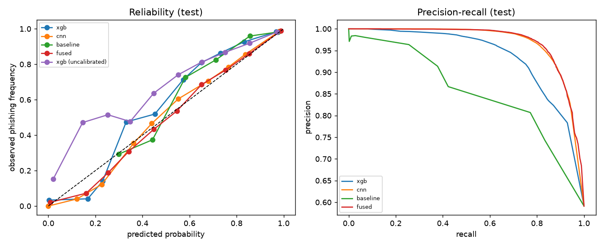
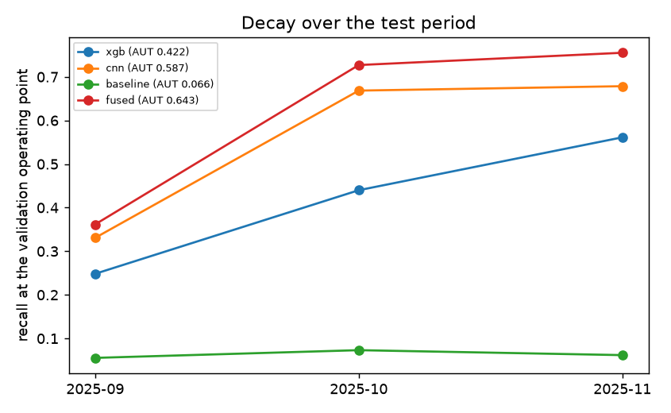
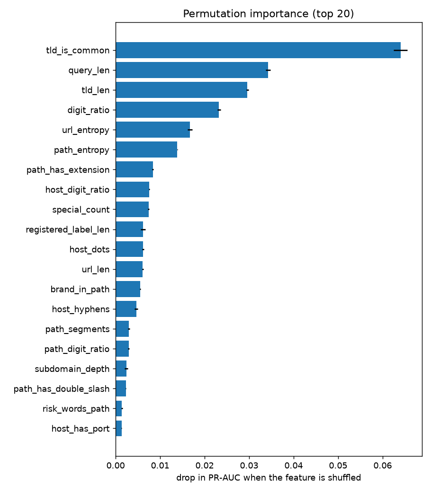

# ThreatFusion — URL maliciousness evaluation

_Generated 2026-10-04T11:34:53Z by `python -m ml.evaluate --report` in 112 s. Bootstrap: 200 resamples of registered domains._

## Data and protocol

* Source: **PhreshPhish (CC-BY-4.0), metadata columns only** — 654,382 URLs (286,525 phishing / 367,857 benign), 2024-07-02 → 2025-12-16.
* Dataset sha256 `68874bb21bbdb49a…`, raw manifest sha256 `c9a8992226caca09…`, feature schema v1 (39 URL-string features).
* Splits are **time-ordered and host-disjoint**: fit on the oldest period, tune/calibrate on the next, test once on the newest.

| split | rows | phishing share | registered domains | period |
|---|---:|---:|---:|---|
| train | 390,263 | 47.2% | 110,357 | 2024-07-02 → 2025-07-10 |
| val | 39,876 | 50.7% | 28,489 | 2025-07-10 → 2025-09-08 |
| test | 70,643 | 59.1% | 47,817 | 2025-09-08 → 2025-12-16 |
| test_unfiltered | 166,553 | 45.2% | 65,278 | 2025-09-08 → 2025-12-16 |

Host-overlap filter removed 95,910 test rows and 57,690 validation rows whose registered domain was in the fitted data. The benchmark is ~45 % phishing; real traffic is far lower (see base rates below).

## Headline comparison (test, host-disjoint; operating point = FPR ≤ 1 % on validation)

| model | PR-AUC | ROC-AUC | F1 | recall @ FPR≤1 % | FPR @ recall 95 % | Brier | ECE |
|---|---|---|---|---|---|---|---|
| a-priori lexical baseline | 0.824 [0.815, 0.832] | 0.789 [0.779, 0.796] | 0.129 [0.114, 0.146] | 0.069 [0.061, 0.079] | 1.000 [1.000, 1.000] | 0.184 [0.182, 0.188] | 0.078 [0.068, 0.087] |
| tree model (URL features) | 0.927 [0.920, 0.933] | 0.899 [0.892, 0.906] | 0.628 [0.613, 0.644] | 0.460 [0.419, 0.478] | 0.994 [0.993, 0.995] | 0.130 [0.126, 0.135] | 0.077 [0.071, 0.083] |
| character CNN | 0.960 [0.954, 0.965] | 0.942 [0.935, 0.949] | 0.787 [0.772, 0.799] | 0.652 [0.632, 0.668] | 0.999 [0.287, 0.999] | 0.092 [0.087, 0.097] | 0.045 [0.039, 0.051] |
| stacked fusion (B7) | 0.969 [0.964, 0.973] | 0.949 [0.943, 0.955] | 0.829 [0.816, 0.840] | 0.699 [0.675, 0.716] | 0.329 [0.294, 0.443] | 0.087 [0.083, 0.092] | 0.032 [0.027, 0.039] |

No metric is 1.0. The baseline's weights were fixed before any model was trained; only its threshold is chosen on validation.

### Same models on the *unfiltered* test set (host overlap allowed)

| model | PR-AUC | ROC-AUC |
|---|---|---|
| a-priori lexical baseline | 0.781 [0.741, 0.823] | 0.834 [0.816, 0.850] |
| tree model (URL features) | 0.942 [0.922, 0.960] | 0.948 [0.936, 0.961] |
| character CNN | 0.963 [0.950, 0.975] | 0.964 [0.955, 0.973] |
| stacked fusion (B7) | 0.974 [0.964, 0.983] | 0.973 [0.965, 0.980] |

The difference between the two tables is the size of the host-overlap leak in a naive evaluation.

### Calibration (test)

| channel | ECE uncalibrated | ECE calibrated | Brier uncalibrated | Brier calibrated |
|---|---|---|---|---|
| tree model (URL features) | 0.115 | 0.077 | 0.142 | 0.130 |
| character CNN | 0.070 | 0.045 | 0.094 | 0.092 |

## B9 — time-aware evaluation

Recall and false-positive rate at the fixed validation operating point, per month of the test period (the model was fitted on older data):

| model | 2025-09 | 2025-10 | 2025-11 | AUT(recall) |
|---|---|---|---|---|
| a-priori lexical baseline | 0.055 (FPR 0.001) | 0.073 (FPR 0.002) | 0.062 (FPR 0.002) | 0.066 |
| tree model (URL features) | 0.248 (FPR 0.010) | 0.440 (FPR 0.010) | 0.561 (FPR 0.003) | 0.422 |
| character CNN | 0.331 (FPR 0.007) | 0.668 (FPR 0.006) | 0.679 (FPR 0.006) | 0.587 |
| stacked fusion (B7) | 0.362 (FPR 0.012) | 0.727 (FPR 0.011) | 0.755 (FPR 0.011) | 0.643 |

### Precision at realistic phishing prevalence (derived from the measured TPR / FPR)

| model | TPR | FPR | π = 0.05% | π = 0.10% | π = 0.50% | π = 1.00% | π = 5.00% |
|---|---|---|---|---|---|---|---|
| a-priori lexical baseline | 0.069 | 0.0020 | 0.017 | 0.033 | 0.147 | 0.258 | 0.644 |
| tree model (URL features) | 0.460 | 0.0096 | 0.023 | 0.046 | 0.194 | 0.326 | 0.716 |
| character CNN | 0.652 | 0.0068 | 0.046 | 0.088 | 0.325 | 0.492 | 0.835 |
| stacked fusion (B7) | 0.713 | 0.0120 | 0.029 | 0.056 | 0.230 | 0.375 | 0.758 |

A detector that looks precise on a 45 %-phishing benchmark is mostly wrong at 0.1 % prevalence: this table is *derived* (`precision = TPR·π / (TPR·π + FPR·(1-π))`), not re-measured.

### Which features carry the model? (permutation importance on test)

Features with a meaningful importance (mean drop − 2 sd > 0): **25** of 39.

| group | drop in PR-AUC when the whole group is shuffled |
|---|---|
| surface | 0.1292 ± 0.0014 |
| host | 0.1117 ± 0.0014 |
| path | 0.0310 ± 0.0009 |
| brand | 0.0082 ± 0.0002 |
| risk | 0.0026 ± 0.0002 |

Top features: `tld_is_common` (0.0640), `query_len` (0.0342), `tld_len` (0.0296), `digit_ratio` (0.0232), `url_entropy` (0.0167), `path_entropy` (0.0139), `path_has_extension` (0.0084), `host_digit_ratio` (0.0075), `special_count` (0.0074), `registered_label_len` (0.0062)

### Cheap evasions (recall on real phishing URLs at the fixed operating point)

| edit | tree before → after | CNN before → after | baseline before → after |
|---|---|---|---|
| append_query | 0.459 → 0.982 | 0.652 → 0.940 | 0.070 → 0.105 |
| extra_subdomain | 0.459 → 0.485 | 0.652 → 0.636 | 0.070 → 0.091 |
| benign_path_prefix | 0.459 → 0.151 | 0.652 → 0.073 | 0.070 → 0.079 |
| pad_path | 0.459 → 0.354 | 0.652 → 0.525 | 0.070 → 0.080 |

Reading the table: the edits use tokens the models never saw in adversarial training. A drop is an evasion that works; a *rise* (e.g. appending a query string) means the model treats that edit as a phishing cue because of how this dataset was crawled — a dataset artefact, not a property of phishing. The URL channel is therefore one input among several, never a verdict on its own.

### False positives on real benign login / checkout / account pages (n = 1,311)

| model | FPR at the validation operating point |
|---|---|
| a-priori lexical baseline | 0.0031 |
| tree model (URL features) | 0.0061 |
| character CNN | 0.0107 |
| stacked fusion (B7) | 0.0183 |

## B4 — brand impersonation on real data

On a sample of 70,643 test URLs (28,875 benign, 41,768 phishing):

* **False-positive rate on real benign URLs: 0.0007** (20 flagged).
* Share of all phishing URLs flagged as a look-alike: 0.008.
* Of the 6,518 phishing pages whose targeted brand is in the curated list: **recall 0.035**; when flagged, the matched brand equals the labelled target in 0.929 of cases.
* Most phishing in this dataset is hosted on free hosting / generated sub-domains rather than registered look-alike domains, which a look-alike *domain* detector cannot see by design.

## B7 — fusion

| scenario | method | PR-AUC | ROC-AUC | Brier | ECE |
|---|---|---|---|---|---|
| all_channels | stacked | 0.969 | 0.949 | 0.087 | 0.032 |
| all_channels | noisy_or | 0.967 | 0.946 | 0.214 | 0.263 |
| all_channels | mean | 0.967 | 0.947 | 0.112 | 0.148 |
| cnn_down | stacked | 0.943 | 0.915 | 0.128 | 0.108 |
| cnn_down | noisy_or | 0.943 | 0.914 | 0.170 | 0.175 |
| cnn_down | mean | 0.943 | 0.915 | 0.139 | 0.146 |
| xgb_down | stacked | 0.964 | 0.942 | 0.096 | 0.059 |
| xgb_down | noisy_or | 0.961 | 0.937 | 0.159 | 0.190 |
| xgb_down | mean | 0.961 | 0.938 | 0.116 | 0.144 |
| only_baseline | stacked | 0.821 | 0.792 | 0.206 | 0.145 |
| only_baseline | noisy_or | 0.824 | 0.789 | 0.184 | 0.078 |
| only_baseline | mean | 0.824 | 0.789 | 0.184 | 0.078 |

Stacker weights (log-odds per channel logit): xgb 0.51, cnn 0.69, baseline 0.60; missingness terms: xgb -0.21, cnn -0.21, baseline -0.17.

The three channels all read the same URL, so they are *not* independent — noisy-OR's assumption does not hold and it over-states confidence when channels agree; the table measures the effect rather than assuming it.

## Limits

* The data is a research benchmark, not traffic. The score is about the URL **text** only.
* No page content, DNS, TLS, registration or reputation features were available at scale (see `ml/collect.py`).
* PhreshPhish URLs were crawled by one pipeline: some of what the model learns is the *dataset's* shape. The time-ordered, host-disjoint protocol limits, but cannot remove, this.
* Thresholds and calibration are tied to the validation prevalence; use the base-rate table for deployment reasoning.
